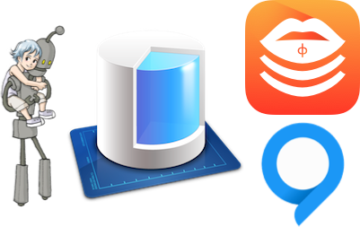

(deprecated, please do not use)

# PhiLipsStack - ϕ:lips: - embrace [CoreData](https://developer.apple.com/library/ios/documentation/DataManagement/Devpedia-CoreData/coreDataOverview.html#//apple_ref/doc/uid/TP40010398-CH28-SW1)
[](http://mit-license.org) [](https://developer.apple.com/resources/) [](https://developer.apple.com/swift) [](https://github.com/phimage/Prephirences/issues) [](http://cocoadocs.org/docsets/PhiLipsStack/)

[](#logo) PhiLipsStack aims to create a [CoreData stack](https://developer.apple.com/library/ios/documentation/DataManagement/Devpedia-CoreData/coreDataStack.html#//apple_ref/doc/uid/TP40010398-CH25-SW1) from [model](https://developer.apple.com/library/ios/documentation/DataManagement/Devpedia-CoreData/managedObjectContext.html) to [context](https://developer.apple.com/library/ios/documentation/DataManagement/Devpedia-CoreData/managedObjectContext.html) and provide some functions on your [managed object](https://developer.apple.com/library/ios/documentation/DataManagement/Devpedia-CoreData/managedObject.html) which use by default the default stack context but not only

```swift
let context = NSManagedObjectContext.defaultContext
var object: MyManagedObject = MyManagedObject.create()
object.delete()
```
With PhiLipsStack you should use [QueryKit](https://github.com/QueryKit/QueryKit) to create query and the command line tool [mogenerator](https://github.com/rentzsch/mogenerator) to generate your `NSManagedObject` from model

## Contents ##
- [Stack and optional configuration](#stack-and-optional-configuration)
- [Play with managed objects: CRUD](#play-with-managed-objects-crud)
- [Setup](#setup)
- [Licence](#licence)
- [Logo](#logo)

## Stack and optional configuration ##
A `CoreDataStack` is composed of three elements
- [`managedObjectModel`](#the-model)
- [`persistentStoreCoordinator`](#the-persistance-store-coordinator)
- [`managedObjectContext`](#the-managed-object-context)

and initialized with persistance store type and optionnal URL

```swift
var myStack = CoreDataStack(storeType: .SQLite, storeURL: anURL)
```
A default one is accessible with SQLite type and your application directory
```swift
CoreDataStack.defaultStack
```

### [The model](https://developer.apple.com/library/ios/documentation/DataManagement/Devpedia-CoreData/managedObjectModel.html) ###

The stack use your application name as model name (ex: model file `MyAppName.xcdatamodel`)
If your model have another name, you can set your own model name by calling `myStack.modelName = "MyModelName"`
```swift
CoreDataStack.defaultStack.modelName = "MyModelName"
```
:warning: This must be done before requesting any of `managedObjectContext`, `persistentStoreCoordinator`, `managedObjectModel` or calling framework functions

### [The persistance store coordinator](https://developer.apple.com/library/ios/documentation/DataManagement/Devpedia-CoreData/persistentStoreCoordinator.html) ###

By default the persistance store coordinatore is initialized with [automigrate option](https://developer.apple.com/library/mac/documentation/Cocoa/Reference/CoreDataFramework/Classes/NSPersistentStoreCoordinator_Class/index.html#//apple_ref/doc/constant_group/Migration_Options)
*To change this behaviour set stack `autoMigrate` to false*

If not able to load data from current persistance files, all data are removed (`removeStore()`) and new empty files are created.
*To change this behaviour set `removeIncompatibleStore` to false*

### [The managed object context](https://developer.apple.com/library/ios/documentation/DataManagement/Devpedia-CoreData/managedObjectContext.html) ###

The default context can be accessed by class variable on `NSManagedObjectContext`
```swift
NSManagedObjectContext.defaultContext
```
*This default context is the `managedObjectContext` attribute of default stack `CoreDataStack.defaultStack`. So you can change the defaultStack by your own if necessary*

## Play with managed objects: CRUD ##

### Create
Your  `NSManagedObject` must contains `@objc(classname)` or you must override `entityName` class var

```swift
@objc(MyEntity)
class MyEntity: NSManagedObject {
	@NSManaged var title: String
	@NSManaged var valid: NSNumber
}
```
*You could use the command line tool [mogenerator](https://github.com/rentzsch/mogenerator) to generate your `NSManagedObject` from model*

Then to create an object in default context
```swift
var entity = MyEntity.create()
var entity = MyEntity.createWithAttribute([key:value])
```
To create only if not exists, two useful functions
```swift
var entity: MyEntity = MyEntity.findFirstOrCreate()
var anotherEntity: MyEntity.findFirstOrCreateWithPredicate(aPredicate)
```

### Read/Fetch
Get all object of one type
```swift
if let entities = MyEntity.all() ? [Entity] { .. }
let entityCount = MyEntity.count()
```
Some basic filtering using `NSPredicate`
```
if let entities = MyEntity.find(predicate) ? [Entity] { .. }
let entityCount = MyEntity.count(predicate)
```
For more advanced fetch with predicates, you should use [QueryKit](https://github.com/QueryKit/QueryKit).
```swift
let myEntityQuerySet = QuerySet<MyEntity>(NSManagedObjectContext.defaultContext, MyEntity.entityName)
```

There is a mogerator templates for swift [here: machine.swift.motemplate](https://github.com/phimage/mogenerator-template)

### Update and Save
Update your objects as usual by modifying attributes and relations, then you can save immediately your object
```swift
entity.save()
```
But it is recommanded to save the context when application will terminate or did enter background - see [application delegate example](/Sample/AppDelegate.swift)
```swift
stack.save()
```
### Delete
Delete object is as simple as following
```swift
entity.delete()
```
You can also delete all objects of specific type
```swift
Entity.deleteAll()
```
### Error handling
Most of the functions provided by this framework allow to pass an error handler, a block of type `(NSError) -> Void`

```swift
entity.delete { (error) -> () in

}
Entity.find(NSPredicate(value: true)) { (error) -> () in

}
```
If no error handler is provided, you can access the last error handled by the stack
```swift
if let error = myStack.lastError {..}
```

At application start you can also check stack validity (context not nil)
```swift
if !myStack.valid() {
   // log and application shutdown
}
// or with error handler
myStack.valid((error: NSError)  in {
    // log and application shutdown
}
```
# Setup #

## Using xcode project ##

1. Drag PhiLipsStack.xcodeproj to your project/workspace or open it to compile it
2. Add the PhiLipsStack framework to your project

## Using [cocoapods](http://cocoapods.org/) ##

Add `pod 'PhiLipsStack'` to your `Podfile` and run `pod install`. 

Add `use_frameworks!` to the end of the `Podfile`.

# Licence #
```
The MIT License (MIT)

Copyright (c) 2015 Eric Marchand (phimage)

Permission is hereby granted, free of charge, to any person obtaining a copy
of this software and associated documentation files (the "Software"), to deal
in the Software without restriction, including without limitation the rights
to use, copy, modify, merge, publish, distribute, sublicense, and/or sell
copies of the Software, and to permit persons to whom the Software is
furnished to do so, subject to the following conditions:

The above copyright notice and this permission notice shall be included in all
copies or substantial portions of the Software.

THE SOFTWARE IS PROVIDED "AS IS", WITHOUT WARRANTY OF ANY KIND, EXPRESS OR
IMPLIED, INCLUDING BUT NOT LIMITED TO THE WARRANTIES OF MERCHANTABILITY,
FITNESS FOR A PARTICULAR PURPOSE AND NONINFRINGEMENT. IN NO EVENT SHALL THE
AUTHORS OR COPYRIGHT HOLDERS BE LIABLE FOR ANY CLAIM, DAMAGES OR OTHER
LIABILITY, WHETHER IN AN ACTION OF CONTRACT, TORT OR OTHERWISE, ARISING FROM,
OUT OF OR IN CONNECTION WITH THE SOFTWARE OR THE USE OR OTHER DEALINGS IN THE
SOFTWARE.
```

# Misc #
 Readme done with [Haroopad](https://github.com/rhiokim/haroopad)
## Logo ##
Inspired by [apple swift logo](http://en.wikipedia.org/wiki/File:Apple_Swift_Logo.png)
### Why a logo?
I like to see an image for each of my project when I browse them with [SourceTree](http://www.sourcetreeapp.com/)
## Core Data Combo

*mogenerator, PhiLipsStack, QueryKit*


[](https://bitdeli.com/free "Bitdeli Badge")

